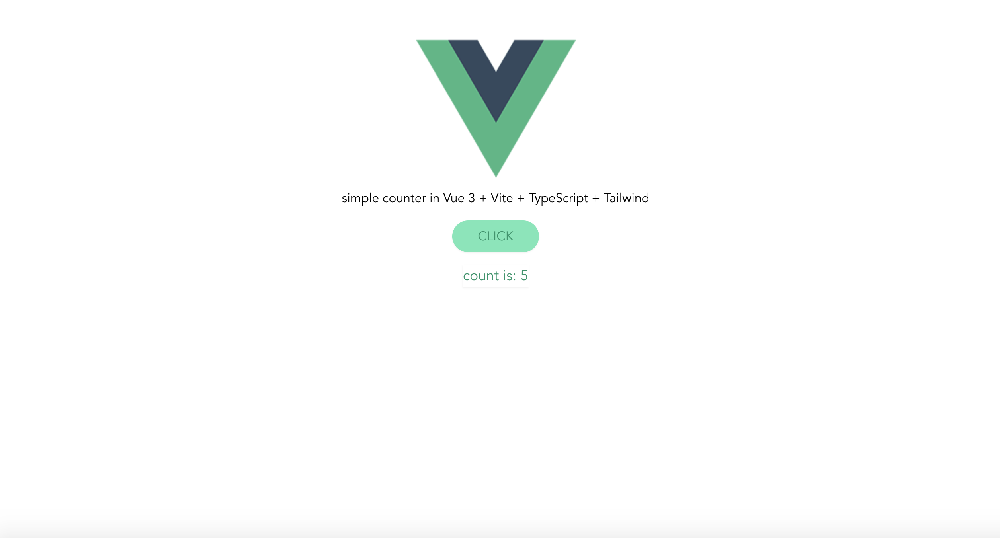

##  a simple starter for [Vue 3](https://v3.vuejs.org/) with [Vite](https://vitejs.dev/), [TypeScript](https://www.typescriptlang.org/docs/) & [Tailwind CSS](https://tailwindcss.com/docs)  

- with the standard counter demo of the Vite starter in [Composition API](https://v3.vuejs.org/guide/composition-api-introduction.html) style

### [Vercel link](https://vue3-starter.vercel.app/)

 <kbd>
  

</kbd>

## 🥳
